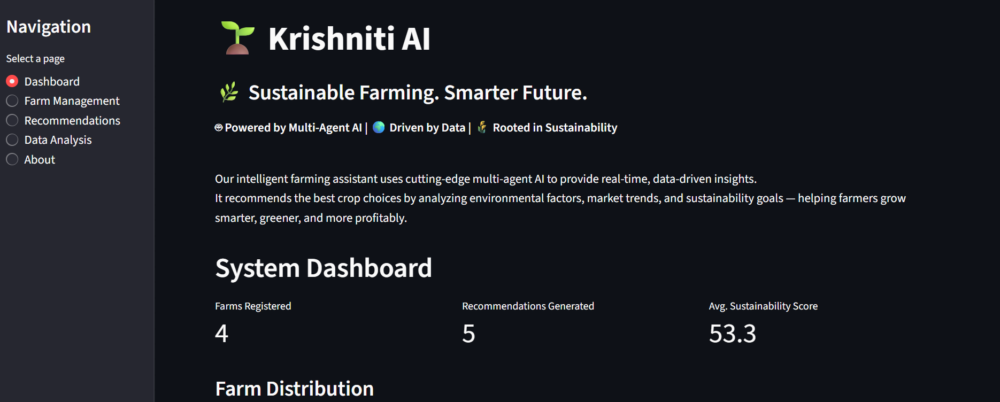
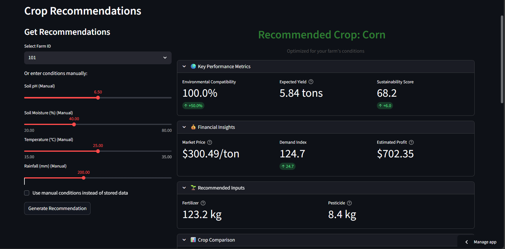
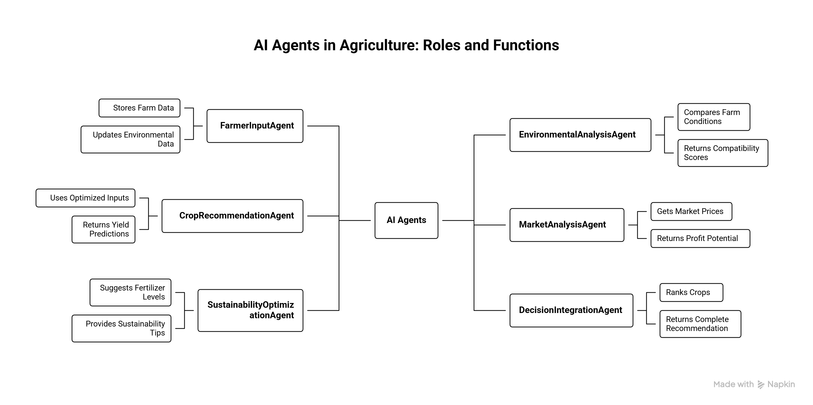
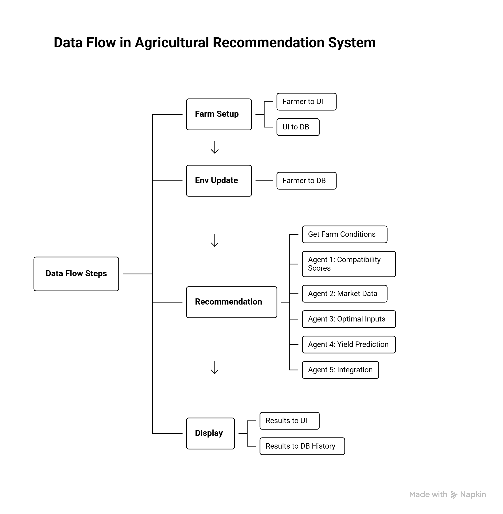

# KrishNiti AI: Data-Driven Agritech Intelligence
<br>

**Live Demo:  [Click Here for Live Demo](https://krishniti-ai.streamlit.app/)** <div id="top"></div>

<br>

## 📄 Overview

Krishniti AI revolutionizes Indian agriculture by delivering a **multi-agent AI platform** designed to combat climate uncertainty, unify fragmented agricultural data, and drive sustainable, profitable farming practices. Traditional farming often grapples with unpredictable environmental conditions, fragmented information, and the challenge of balancing economic viability with ecological responsibility. Our innovative solution addresses these critical pain points, empowering farmers with actionable, real-time insights.

This platform leverages advanced AI to integrate diverse data streams, transforming raw environmental, crop, and market data into intelligent recommendations. By doing so, Krishniti AI aims to mitigate risks associated with climate change, optimize resource utilization, and significantly enhance farmer livelihoods through data-driven decision-making.

Our hybrid model addresses this by combining the robust spatial feature extraction capabilities of DenseNet-121 with the statistical regularities identified through Shannon entropy, capturing inconsistencies inherent in GAN-generated images.

---

<br>

## ✨ Key Features

* **Modular Multi-Agent Architecture:** Engineered a robust 6-agent OOP architecture, seamlessly integrating environmental, crop, market, and sustainability metrics for scalable intelligence.
* **Centralized ACID-Compliant Database:** Designed and implemented a robust SQLite database for inter-agent communication, ensuring data integrity and reliable long-term memory.
* **Data-Driven "Green Score" System:** Developed an innovative "Green Score" system providing real-time eco-impact insights to promote responsible, environmentally friendly farming.
* **Pre-trained Hindi Voice Assistant:** Integrated a Hindi Voice Assistant, enhancing platform accessibility and engagement for rural Indian farmers.
* **Optimized Farm-to-Consumer Sales:** Strategized integration with an Urban Food Desert Detection system to streamline direct sales, increasing farmer profits and food access.
* **Predictive Analytics for Yield & Sustainability:** Utilizes machine learning (e.g., RandomForestRegressor) to predict crop yield, optimal resource usage, and sustainability scores.
* **Balanced Impact Recommendations:** The Decision Integration Agent combines insights to generate holistic recommendations, optimizing both financial returns and ecological footprint.
---

<br>

## 🖼️ Visual Demonstration

Here are some visuals showcasing the application's interface and capabilities:


<div style="display: flex; flex-wrap: wrap; justify-content: space-around; gap: 10px;">
  <div style="flex: 1 1 300px; max-width: 48%; text-align: center; border: 1px solid #eee; padding: 5px;">
    <br>
    <p><b>Streamlit App Interface</b></p>
    <br>
    
  </div>
  <hr style="border: none; background-color: #ccc; height: 0.1px; margin: 20px 0;">
  
  <div style="flex: 1 1 300px; max-width: 48%; text-align: center; border: 1px solid #eee; padding: 5px;">
    <br>
    <p><b>Prediction Details</b></p>
    <br>
    
  </div>
</div>


---

<br>

## 📊 Dataset

**1. Farmer Advisor Dataset (`farmer_advisor_dataset.csv`)**

This dataset captures **farm-level environmental conditions, management practices, and outcomes** across **10,000 records**.  
It is used to train and evaluate the **yield prediction**, **crop advisory**, and **sustainability scoring** components.

#### **Key Columns**

| Column Name | Description |
|-------------|-------------|
| **Farm_ID** | Unique identifier for each farm record. |
| **Soil_pH** | Soil acidity/alkalinity level — used for crop–soil compatibility analysis. |
| **Soil_Moisture** | Soil moisture percentage — crucial for water stress assessment. |
| **Temperature_C** | Average temperature in °C at the farm. |
| **Rainfall_mm** | Recent or seasonal rainfall in millimeters. |
| **Crop_Type** | Crop grown (e.g., Wheat, Corn, Soybean, Rice). |
| **Fertilizer_Usage_kg** | Fertilizer applied per unit area (kg). |
| **Pesticide_Usage_kg** | Pesticide applied per unit area (kg). |
| **Crop_Yield_ton** | Observed yield in tons — **primary target variable** for prediction. |
| **Sustainability_Score** | Environmental/resource efficiency score — used for sustainability modeling. |

#### **How Krishniti AI Uses This Dataset**

- Trains ML models to **predict Crop_Yield_ton** and **Sustainability_Score** based on soil, weather, and farm inputs.  
- Powers the **Crop Recommendation Agent**, optimizing soil–crop matching.
- Supports the **Sustainability Optimization Agent**, advising on eco-friendly farming practices.
- Generates dynamic, realistic UI insights like:  
  - “Expected yield for given inputs”  
  - “Predicted sustainability score”  

<br>

**2. Market Researcher Dataset (`marketer_researcher_dataset.csv`)**

This dataset captures **market dynamics**, including prices, demand/supply indicators, seasonality, and economic influences across **10,000 market snapshots**.

#### **Key Columns**

| Column Name | Description |
|-------------|-------------|
| **Market_ID** | Unique identifier for each market snapshot. |
| **Product** | Crop/product name (e.g., Rice, Wheat, Corn). |
| **Market_Price_per_ton** | Current market selling price (per ton). |
| **Demand_Index** | Indicator of product demand (higher = stronger demand). |
| **Supply_Index** | Indicator of market supply (higher = more supply). |
| **Competitor_Price_per_ton** | Average competitor selling price. |
| **Economic_Indicator** | Macro-economic condition score (cost pressure, profitability, etc.). |
| **Weather_Impact_Score** | Effect of weather on market volatility and risk. |
| **Seasonal_Factor** | Categorical (Low/Medium/High) indicator of seasonality impact. |
| **Consumer_Trend_Index** | Measure of changing consumer preference for the product. |

#### **How Krishniti AI Uses This Dataset**

- Feeds the **Market Analysis Agent** to estimate:
  - Expected revenue  
  - Profitability  
  - Market risk  
- Helps rank crops by **economic viability**, not just agronomic suitability.  
- Enables real-time recommendations like:  
  - “Grow Crop X instead of Crop Y due to better demand and pricing this season.”  
  - “High volatility detected — diversify crop selection.”

<br>

## ⚙️ System Architecture & Logic Flow

The Krishniti AI platform is built around a sophisticated multi-agent system designed to process diverse agricultural data and provide comprehensive recommendations.

<br>
   
**Core Agents:**

1.  **Farmer Input Agent:** Gathers and processes farm-specific data from the farmer.
2.  **Environmental Analysis Agent:** Analyzes soil, temperature, and rainfall data to assess environmental suitability.
3.  **Crop Recommendation Agent:** Uses machine learning models to predict optimal crop performance based on environmental factors.
4.  **Market Analysis Agent:** Analyzes current market trends and pricing to maximize profitability.
5.  **Sustainability Optimization Agent:** Recommends practices to improve environmental sustainability and resource efficiency.
6.  **Decision Integration Agent:** Synthesizes information from all preceding agents to generate final, balanced recommendations.


<br>

<div style="display: flex; flex-wrap: wrap; justify-content: space-around; gap: 10px;">
    <div style="flex: 1 1 300px; max-width: 48%; text-align: center; border: 1px solid #eee; padding: 5px;">
        <div align="center">
          
        </div>    
    </div>
</div>

<br>

<div style="display: flex; flex-wrap: wrap; justify-content: space-around; gap: 10px;">
    <div style="flex: 1 1 300px; max-width: 48%; text-align: center; border: 1px solid #eee; padding: 5px;">
        <div align="center">
          
        </div>    
    </div>
</div>

---

<br>

## 💻 Technologies Used

This project leverages a focused set of key technologies:

* **Python:** The foundational programming language.
* **TensorFlow & Keras:** For building and running the hybrid deep learning model (DenseNet-121).
* **Streamlit:** For the interactive web application interface (`app2.py`).
* **Flask:** For the alternative web interface (`app.py`).
* **NumPy:** Essential for high-performance numerical computing.
* **OpenCV (cv2) / Pillow:** For image processing and manipulation.
* **`gdown`:** Used for programmatic download of the large pre-trained model.
* **Jupyter Notebook:** For model development, training, and experimentation.

---

<br>

## 📂 Project Structure

All core files for this project are located in the root directory:

   ```bash
├── images/                  # Contains screenshots and visual assets used in this README.
│   ├── app2_image_prediction.png
│   ├── app2_interface.png
│   ├── app2_prediction_details.png
│   ├── app_image_prediction.png
│   ├── app_interface.png
│   ├── app_prediction_details.png
│   └── system_architecture_flow.png
├── static/                  # Static assets for the Flask web application (app.py).
│   ├── deepfake_hero.jpeg
│   ├── logo.png
│   ├── style.css
│   ├── style1.css
│   └── team.jpg
├── templates/               # HTML template files for the Flask web application (app.py).
│   ├── index.html
│   └── result.html
├── Hybrid model.ipynb       # Jupyter Notebook containing the complete model training, evaluation, and experimentation.
├── LICENSE                  # Specifies the legal terms under which the project can be used and distributed.
├── README.md                # This README file, providing a comprehensive overview and setup instructions for the project.
├── app.py                   # Flask Web Application: The backend logic for the HTML/CSS web interface.
├── app2.py                  # Streamlit Application: The main script for our interactive deepfake detection web interface.
└── requirements.txt         # Lists all Python dependencies required to run the project.
  ```

---

<br>

## 🚀 Getting Started

These instructions will give you a copy of the project up and running on
your local machine for development and testing purposes.

### Prerequisites

Requirements for the software and other tools to build, test and push 
- Python 3.8+ (preferably 3.11)

### Installation

1.  **Clone the Repository:**
   
    ```bash
    git clone https://github.com/dharambirsinghsidhu/EntropyVision_Deepfake_Detector.git
    cd EntropyVision_Deepfake_Detector
    ```

3.  **Create and Activate a Virtual Environment:**

    It's highly recommended to use a virtual environment to manage project dependencies.

    ```bash
    python -m venv venv
    ```

    * **On Windows:**
        ```bash
        .\venv\Scripts\activate
        ```
    * **On macOS/Linux:**
        ```bash
        source venv/bin/activate
        ```

4.  **Install Python Dependencies:**

    First, ensure your `pip` installer is up to date, then install the required Python libraries.

    ```bash
    pip install --upgrade pip
    pip install -r requirements.txt
    pip install streamlit
    ```

End with an example of getting some data out of the system or using it
for a little demo

---

<br>

## 📦 Model Download

Due to the substantial size of our pre-trained deepfake detection model, it is not directly included in this repository. Instead, the application is configured to **automatically download the model from Google Drive** the first time it's run, or if the model file is not found locally. This ensures a smoother setup while keeping the repository lightweight.

**How it works:**

When you run `app2.py`, it will check for the presence of the model file (e.g., in a `models/` directory). If it's missing, a download process will be initiated, typically displaying progress in your terminal. Please ensure you have an active internet connection during the first run. The model will be saved to a designated folder (e.g., `models/` or `weights/`) within your project directory for future use.

<br>

**Download Trained Model:  [Click Here to Download Pre-Trained Model](https://drive.google.com/file/d/1xlTb2ToE82F4wAzTAJxRIejW4lX8bMEy/view?usp=drive_link)** <div id="top"></div>

---

<br>

## ▶️ Running the Application

Once everything is installed, starting the app is simple:

1.  Go to your project's main folder in your terminal.
2.  Type this command and press Enter:
    ```bash
    streamlit run app2.py --server.enableCORS false --server.enableXsrfProtection false
    ```
3.  A new tab will automatically open in your web browser showing the application, usually at `http://localhost:8501`.

---

<br>

## 💡 Using the Deepfake Detector (EntropyVision)

Our tool is designed for easy deepfake detection:

1.  Start the Streamlit application in your browser.
2.  **Upload any image** you want to verify.
3.  The system will process it and show you whether it's **real or a deepfake**, complete with a **confidence level**.

---

<br>

## 🤝 Contributing

We warmly welcome contributions to this project! If you're interested in improving the model, enhancing the user interface, or adding new functionalities, please follow these general steps:

1.  Fork the repository.
2.  Create a new branch for your feature (`git checkout -b feature/YourAwesomeFeature`).
3.  Commit your changes (`git commit -m 'Add a new feature'`).
4.  Push to your branch (`git push origin feature/YourAwesomeFeature`).
5.  Open a Pull Request, describing your changes in detail.

Please make sure your code adheres to good practices and includes relevant tests if applicable.

---

<br>

## 📧 Contact

For any questions or collaborations, feel free to reach out to the project maintainer:

* **Dharambir Singh Sidhu:** dharambirsinghsidhu.work@gmail.com

<br>

---
---

<br>

## 📚 Appendix: Alternative Web Interface (`app.py`)

In addition to the Streamlit application, this project also includes an alternative web interface built with HTML/CSS and potentially powered by Flask (`app.py`). This interface offers a different approach to interacting with the deepfake detection model, showcasing flexibility in deployment options.

<br>

## 💡 How to Run the HTML/CSS Interface

1.  **Ensure you have activated your virtual environment** (as described in "Local Setup and Installation").
   
2.  **Navigate to your project's root directory** in the terminal.
   
3.  **Install Python Dependencies:**

    First, ensure your `pip` installer is up to date, then install the required Python libraries.

    ```bash
    pip install --upgrade pip
    pip install -r requirements.txt
    ```
    
4.  **Run the Flask application:**
    ```bash
    python app.py
    ```
7.  The application should then be accessible in your web browser, typically at `http://127.0.0.1:5000/` or a similar local address indicated in your terminal.

---

<br>

### 📸 Visual Demonstration ('app.py')

<div style="display: flex; flex-wrap: wrap; justify-content: space-around; gap: 10px;">
  <div style="flex: 1 1 300px; max-width: 48%; text-align: center; border: 1px solid #eee; padding: 5px;">
    <br>
    <p><b>Web App Interface</b></p>
    <br>
    
  </div>
  <hr style="border: none; background-color: #ccc; height: 0.1px; margin: 20px 0;">
  <div style="flex: 1 1 300px; max-width: 48%; text-align: center; border: 1px solid #eee; padding: 5px;">
    <br>
    <p><b>Upload Image</b></p>
    <br>
    
  </div>
  <hr style="border: none; background-color: #ccc; height: 0.1px; margin: 20px 0;">
  <div style="flex: 1 1 300px; max-width: 48%; text-align: center; border: 1px solid #eee; padding: 5px;">
    <br>
    <p><b>Prediction Details</b></p>
    <br>
    
  </div>
</div>

---

<br>

<div style="display: flex; flex-wrap: wrap; justify-content: space-around; gap: 10px;">
    <div style="flex: 1 1 300px; max-width: 48%; text-align: center; border: 1px solid #eee; padding: 5px;">
        <div align="center">
              <div>© 2025 Dharambir Singh Sidhu. Licensed under the <a href="./LICENSE">MIT License</a>.</div>
          <br>
          🔹<a href="#top"> Back to Top </a>🔹
        </div>    
    </div>
</div>

<br>

---
